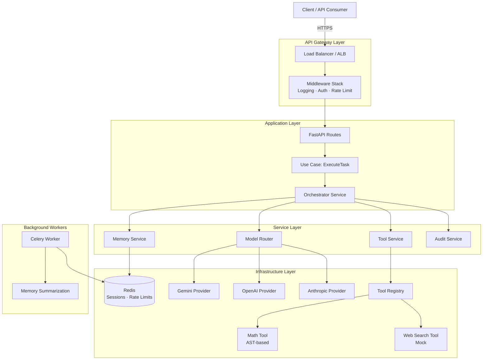

# Simple Architecture Overview

## Component Responsibilities

### API Layer

- **Routes** — thin request handlers; validate input, delegate to use cases, return structured responses.
- **Schemas** — Pydantic models enforcing request/response contracts. Extra fields are rejected.
- **Middleware** — cross-cutting concerns applied to every request:
  - `LoggingMiddleware` — request/response logging with request_id and trace_id.
  - `AuthMiddleware` — JWT bearer token verification; attaches user identity to request state.
  - `RateLimitMiddleware` — Redis-backed sliding-window per-user rate limiter.

### Application Layer

- **ExecuteTaskUseCase** — sanitizes input, generates session/trace IDs, delegates to orchestrator.
- **Orchestrator** — core execution loop: load memory → build messages → call LLM → execute tools → save memory → return result.
- **MemoryService** — abstracts Redis session storage; handles message append, retrieval, trimming.
- **ToolService** — resolves tools from registry, executes with timeout, logs each call.
- **ModelRouter** — selects LLM provider based on config (openai, anthropic, gemini); caches provider instances; requires API key for chosen provider.
- **AuditService** — structured logging of execution lifecycle events.

### Domain Layer

- **Models** — pure data classes: `Session`, `Message`, `ToolCallRequest`, `ToolCallResult`, `LLMResponse`.
- **Interfaces** — ABCs defining contracts for `LLMProviderInterface`, `MemoryStoreInterface`, `ToolInterface`.
- **Enums** — `ExecutionStatus`, `ToolCallStatus`, `ErrorCode`, `LLMProviderName`, `ToolName`, `UserRole`.
- Domain has zero framework imports.

### Infrastructure Layer

- **LLM Providers** — concrete implementations (OpenAI, Anthropic, Gemini) behind a common interface. Factory pattern for instantiation.
- **Redis Memory Store** — async Redis client implementing `MemoryStoreInterface`.
- **Tools** — `MathTool` (safe AST evaluation), `WebSearchTool` (deterministic mock), `ToolRegistry` (registration and schema listing).
- **Security** — JWT creation/decoding, RBAC role guard utilities.
- **Logging** — structlog-based structured JSON logging with contextvar-based request/trace ID propagation.

### Workers

- **Celery** — background task processing with Redis broker. Supports memory summarization as an async job.

## AWS Deployment Mapping

| Component              | AWS Service                     |
| ---------------------- | ------------------------------- |
| Load Balancer          | Application Load Balancer (ALB) |
| Application            | ECS Fargate / EKS               |
| Redis                  | Amazon ElastiCache (Redis)      |
| Background Workers     | ECS Fargate tasks               |
| Secrets                | AWS Secrets Manager             |
| Logging                | CloudWatch Logs                 |
| Monitoring             | CloudWatch Metrics + X-Ray      |
| API Gateway (optional) | Amazon API Gateway              |
| Container Registry     | Amazon ECR                      |

## Modular Monolith vs Microservices

This system is built as a **modular monolith** with clear layer boundaries:

**Why modular monolith now:**

- Single deployment unit reduces operational complexity for an assessment/MVP stage.
- Clean domain boundaries mean services can be extracted to microservices later.
- Shared Redis state is simpler without cross-service coordination.
- Faster iteration during development.

**Path to microservices:**

- The tool execution layer could become an independent service behind a queue.
- The LLM provider layer could become a gateway service routing to multiple models.
- Memory management could become a standalone session service.
- Each service boundary is already defined by the interface/implementation split.

